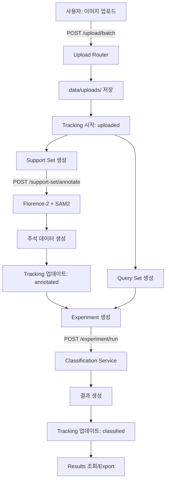

# ALA-Web Development Plan

> **Auto-Label Agent Web Application - 전체 개발 계획서**  
> Version: 1.0  
> Last Updated: 2025-11-23

---

## 📋 목차 (Table of Contents)

1. [프로젝트 개요](#-프로젝트-개요)
2. [시스템 아키텍처](#-시스템-아키텍처)
3. [기술 스택](#-기술-스택)
4. [개발 로드맵](#-개발-로드맵)
5. [구현 현황](#-구현-현황)
6. [데이터 흐름](#-데이터-흐름)
7. [API 설계](#-api-설계)
8. [프론트엔드 설계](#-프론트엔드-설계)
9. [향후 계획](#-향후-계획)

---

## 🎯 프로젝트 개요

### 프로젝트 목적
ALA-Web은 자동 라벨링 에이전트를 위한 웹 기반 인터페이스로, 이미지 주석, 분류 실험 관리, 데이터 파이프라인 추적 기능을 제공합니다.

### 핵심 기능
1. **Annotation Workflow**: Florence-2 + SAM2를 활용한 자동 이미지 주석
2. **Classification Workflow**: 실험 기반 이미지 분류 시스템
3. **Data Flow Tracking**: 파이프라인 단계별 데이터 추적
4. **Preprocessing**: 이미지 전처리 및 변환
5. **Gallery**: 업로드된 이미지 및 결과 관리

### 프로젝트 목표
- ✅ 신규 사용자도 5-10분 내 설치 및 실행 가능
- ✅ 간단한 배치 스크립트로 원클릭 설정
- ✅ FastAPI + React 기반의 현대적인 웹 아키텍처
- 🔄 AI 모델(Florence-2, SAM2) 통합
- 🔄 실시간 데이터 추적 및 모니터링
- 📅 대규모 데이터셋 처리 지원

---

## 🏗️ 시스템 아키텍처

### 전체 구조

```
┌─────────────────────────────────────────────────────────────┐
│                      사용자 브라우저                          │
│                  (http://localhost:5173)                     │
└────────────────────┬────────────────────────────────────────┘
                     │
                     │ HTTP/REST API
                     │
┌────────────────────▼────────────────────────────────────────┐
│                   FastAPI 백엔드                             │
│                (http://localhost:8000)                       │
│                                                              │
│  ┌──────────────┐  ┌──────────────┐  ┌──────────────┐      │
│  │  Routers     │  │  Services    │  │  AI Models   │      │
│  │ - upload     │  │ - annotation │  │ - Florence-2 │      │
│  │ - annotate   │  │ - classify   │  │ - SAM2       │      │
│  │ - classify   │  │ - preprocess │  │              │      │
│  │ - tracking   │  │              │  │              │      │
│  └──────────────┘  └──────────────┘  └──────────────┘      │
│                                                              │
│  ┌──────────────────────────────────────────────────────┐   │
│  │            Data Storage (JSON + 파일시스템)            │   │
│  │  - experiments.json                                   │   │
│  │  - support_sets.json                                  │   │
│  │  - query_sets.json                                    │   │
│  │  - tracking.json                                      │   │
│  │  - data/uploads/ (이미지 파일)                         │   │
│  └──────────────────────────────────────────────────────┘   │
└─────────────────────────────────────────────────────────────┘
```

### 계층 구조

```
Presentation Layer (프론트엔드)
    ├── React Components
    ├── Custom Hooks (API 통신)
    └── TailwindCSS (스타일링)

API Layer (백엔드)
    ├── FastAPI Routers
    ├── Pydantic Models (데이터 검증)
    └── CORS Middleware

Business Logic Layer
    ├── Services (주석, 분류, 전처리)
    ├── AI Model Integration
    └── 데이터 변환 로직

Data Layer
    ├── JSON 파일 (구조화된 데이터)
    └── 파일 시스템 (이미지/비디오)
```

---

## 🛠️ 기술 스택

### 백엔드 (Backend)

| 항목 | 기술 | 버전 | 용도 |
|------|------|------|------|
| **프레임워크** | FastAPI | 0.103+ | RESTful API 서버 |
| **서버** | Uvicorn | latest | ASGI 서버 |
| **데이터 검증** | Pydantic | 2.4+ | 요청/응답 모델 |
| **언어** | Python | 3.11+ | 백엔드 로직 |
| **AI 프레임워크** | PyTorch | latest | 딥러닝 모델 실행 |
| **모델** | Transformers | latest | Florence-2 |
| **비전** | OpenCV | latest | 이미지 처리 |
| **비전** | Pillow | latest | 이미지 I/O |
| **수치** | NumPy | latest | 배열 연산 |

### 프론트엔드 (Frontend)

| 항목 | 기술 | 버전 | 용도 |
|------|------|------|------|
| **프레임워크** | React | 18.2 | UI 컴포넌트 |
| **언어** | TypeScript | 5.9 | 타입 안전성 |
| **빌드 툴** | Vite | 7.2 | 개발 서버 & 빌드 |
| **스타일링** | TailwindCSS | 3.4 | 유틸리티 CSS |
| **HTTP 클라이언트** | Axios | 1.13+ | API 통신 |
| **캔버스** | Konva / React-Konva | 10.0+ | 이미지 주석 |
| **아이콘** | Lucide React | 0.554 | UI 아이콘 |
| **린팅** | ESLint | 9.39+ | 코드 품질 |

### 개발 환경 (Development)

```
Windows 환경
├── Python 가상환경 (backend/ala)
├── Node.js 환경 (frontend/nodeenv) - nodeenv 사용
├── 배치 스크립트 (.bat)
│   ├── setup.bat (초기 설정)
│   ├── start-all.bat (전체 실행)
│   ├── start-backend.bat (백엔드 실행)
│   └── start-frontend.bat (프론트엔드 실행)
└── 데이터 디렉토리 (data/)
```

---

## 📅 개발 로드맵

### Phase 1: 프로젝트 초기 설정 ✅ (완료)
- [x] 프로젝트 구조 설계
- [x] FastAPI 백엔드 기본 설정
- [x] React + Vite 프론트엔드 설정
- [x] CORS 설정 및 API 연결
- [x] 개발 환경 자동 설정 스크립트 (setup.bat)

### Phase 2: 파일 업로드 시스템 ✅ (완료)
- [x] 단일 파일 업로드 API
- [x] 배치 파일 업로드 API
- [x] 폴더 업로드 지원
- [x] 파일 유효성 검증 (이미지/비디오)
- [x] 파일 목록 조회 및 삭제

### Phase 3: Classification Workflow ✅ (완료)
- [x] Experiment 관리 API (17개 엔드포인트)
  - [x] 실험 생성/조회/삭제
  - [x] 실험 실행
  - [x] 실험 비교
- [x] Support Set 관리
  - [x] Support Set 생성/조회
  - [x] 버전 관리 (v1, v2, v3...)
  - [x] Support Set 복제
- [x] Query Set 관리
- [x] Results Export 기능
- [x] 프론트엔드 Classification 페이지
  - [x] Experiments 탭
  - [x] Support Sets 탭
  - [x] Comparison 탭

### Phase 4: Data Flow Tracking ✅ (완료)
- [x] 파이프라인 상태 추적 API (5개 엔드포인트)
- [x] 이미지별 이력 관리
- [x] 에러 추적 및 재시도
- [x] 프론트엔드 Data Flow 페이지
  - [x] 파이프라인 오버뷰
  - [x] 에러 목록 및 재시도

### Phase 5: AI Model Integration 🔄 (진행 중)
- [x] 기본 Annotation Service 구조
- [ ] Florence-2 모델 통합
- [ ] SAM2 모델 통합
- [ ] 모델 로딩 및 초기화
- [ ] GPU 지원 및 최적화
- [ ] 배치 처리 지원

### Phase 6: Preprocessing & Gallery 📅 (예정)
- [ ] 이미지 전처리 파이프라인
- [ ] Gallery 페이지 완성
- [ ] 이미지 필터링 및 검색
- [ ] 썸네일 생성

### Phase 7: 테스팅 & 문서화 🔄 (진행 중)
- [x] 백엔드 API 테스트 가이드
- [x] 프론트엔드 UI 테스트 가이드
- [x] 사용자 테스트 체크리스트
- [x] README 및 Quick Start 가이드
- [ ] 자동화된 테스트 작성
- [ ] API 문서 자동 생성

### Phase 8: 최적화 & 배포 📅 (미래)
- [ ] 성능 최적화
- [ ] 데이터베이스 마이그레이션 (JSON → PostgreSQL)
- [ ] Docker 컨테이너화
- [ ] CI/CD 파이프라인
- [ ] 프로덕션 배포 가이드

---

## ✅ 구현 현황

### 백엔드 API (22개 엔드포인트)

#### Upload Router (5개)
- `POST /api/upload/file` - 단일 파일 업로드
- `POST /api/upload/batch` - 배치/폴더 업로드
- `GET /api/upload/list` - 업로드 파일 목록
- `DELETE /api/upload/{file_id}` - 파일 삭제
- `GET /api/upload/file/{file_id}` - 파일 다운로드

#### Classification Router (17개)
**Experiment Management:**
- `POST /api/classification/experiment/create`
- `GET /api/classification/experiment/list`
- `GET /api/classification/experiment/{id}`
- `POST /api/classification/experiment/{id}/run`
- `GET /api/classification/experiment/compare`
- `DELETE /api/classification/experiment/{id}`

**Support Set Management:**
- `POST /api/classification/support-set/create`
- `GET /api/classification/support-set/list`
- `GET /api/classification/support-set/{id}`
- `POST /api/classification/support-set/{id}/clone`
- `POST /api/classification/support-set/annotate`

**Query Set Management:**
- `POST /api/classification/query-set/create`
- `GET /api/classification/query-set/list`
- `GET /api/classification/query-set/{id}`

**Results & Export:**
- `GET /api/classification/results/{exp_id}`
- `POST /api/classification/export/{exp_id}`

#### Tracking Router (5개)
- `GET /api/tracking/status` - 파이프라인 상태
- `GET /api/tracking/image/{id}` - 이미지 이력
- `POST /api/tracking/update` - 상태 업데이트
- `GET /api/tracking/errors` - 에러 목록
- `POST /api/tracking/retry/{id}` - 재시도

#### Other Routers
- `annotate.py` - 주석 관련 엔드포인트
- `preprocess.py` - 전처리 엔드포인트
- `images.py` - 이미지 조회 엔드포인트
- `models.py` - 모델 관리 엔드포인트

### 프론트엔드 컴포넌트

#### Pages (5개)
1. **Classification.tsx** (19,987 bytes)
   - Experiments 탭: 실험 생성, 조회, 비교
   - Support Sets 탭: Support Set 관리
   - Comparison 탭: 실험 결과 비교

2. **DataTracking.tsx** (8,400 bytes)
   - 파이프라인 상태 시각화
   - 에러 관리 및 재시도

3. **Preprocessing.tsx** (7,655 bytes)
   - 전처리 설정 및 실행

4. **Gallery.tsx** (1,767 bytes)
   - 이미지 갤러리 뷰

5. **Settings.tsx** (2,208 bytes)
   - 앱 설정 관리

#### Custom Hooks (4개)
1. **useClassification.ts** - Classification API 통신
2. **useTracking.ts** - Tracking API 통신
3. **useUploads.ts** - Upload API 통신
4. **useImages.ts** - Image API 통신

#### Components
- `Layout.tsx` - 전체 레이아웃 및 사이드바

---

## 🔄 데이터 흐름

### 1. 이미지 업로드 ~ 분류 전체 플로우



### 2. 트래킹 시스템

각 이미지는 다음 단계를 거칩니다:

```
uploaded → annotated → preprocessed → classified
   ↓          ↓            ↓              ↓
 (pending) (processing) (complete)    (error)
```

**tracking.json 구조:**
```json
{
  "image_001": {
    "filename": "cat.jpg",
    "current_stage": "annotated",
    "stages": {
      "uploaded": {
        "timestamp": "2025-11-23T10:00:00",
        "status": "complete",
        "metadata": {}
      },
      "annotated": {
        "timestamp": "2025-11-23T10:05:00",
        "status": "complete",
        "metadata": {"boxes": 3}
      }
    },
    "errors": []
  }
}
```

---

## 📡 API 설계

### RESTful 설계 원칙
- ✅ 명사 기반 리소스 경로 (`/experiment`, `/support-set`)
- ✅ HTTP 메소드 활용 (GET, POST, DELETE)
- ✅ 계층적 경로 구조 (`/api/{domain}/{resource}`)
- ✅ 일관된 응답 형식 (JSON)
- ✅ 상태 코드 활용 (200, 404, 500)

### 인증 & 보안 (향후 계획)
- [ ] JWT 토큰 기반 인증
- [ ] API 키 관리
- [ ] Rate Limiting
- [ ] 파일 업로드 크기 제한

### API 문서
- ✅ Swagger UI: http://localhost:8000/docs
- ✅ ReDoc: http://localhost:8000/redoc (FastAPI 기본 제공)

### 에러 처리 패턴

```python
# 표준 에러 응답
{
  "detail": "에러 메시지"
}

# 404 Not Found
raise HTTPException(status_code=404, detail="Resource not found")

# 500 Internal Server Error
raise HTTPException(status_code=500, detail=str(e))
```

---

## 🎨 프론트엔드 설계

### 컴포넌트 아키텍처

```
App.tsx (라우팅)
  ├── Layout.tsx (사이드바 + 메인 영역)
  │   ├── Sidebar (네비게이션)
  │   └── Main Content
  │       ├── Classification.tsx
  │       ├── DataTracking.tsx
  │       ├── Preprocessing.tsx
  │       ├── Gallery.tsx
  │       └── Settings.tsx
```

### State 관리
- ✅ React Hooks (useState, useEffect)
- ✅ Custom Hooks (API 통신 로직 분리)
- 향후: Context API 또는 Zustand 도입 고려

### 스타일링 전략
- ✅ TailwindCSS 유틸리티 클래스
- ✅ 반응형 디자인 (responsive)
- ✅ 다크 모드 준비 (색상 변수 사용)
- ✅ 일관된 색상 팔레트

### 성능 최적화
- ✅ Vite HMR (Hot Module Replacement)
- 향후: React.memo, useMemo, useCallback
- 향후: 이미지 레이지 로딩
- 향후: 가상 스크롤링 (대용량 리스트)

---

## 🔮 향후 계획

### 단기 (1-2개월)
1. **AI 모델 통합 완료**
   - Florence-2 객체 탐지
   - SAM2 마스크 생성
   - 모델 성능 최적화

2. **UI/UX 개선**
   - 로딩 인디케이터
   - 에러 토스트 메시지
   - 프로그레스 바

3. **데이터 관리**
   - 대용량 이미지 처리
   - 배치 처리 최적화
   - 캐싱 전략

### 중기 (3-6개월)
1. **데이터베이스 마이그레이션**
   - PostgreSQL 도입
   - ORM (SQLAlchemy) 사용
   - 데이터 마이그레이션 스크립트

2. **인증 시스템**
   - 사용자 계정 관리
   - 권한 관리 (RBAC)
   - 프로젝트 격리

3. **배포 자동화**
   - Docker 컨테이너화
   - Docker Compose 설정
   - CI/CD 파이프라인 (GitHub Actions)

### 장기 (6개월+)
1. **스케일링**
   - 로드 밸런싱
   - 분산 처리 (Celery)
   - S3 스토리지 통합

2. **고급 기능**
   - 모델 트레이닝 파이프라인
   - Active Learning 지원
   - 협업 기능 (다중 사용자)

3. **모니터링**
   - 로그 수집 (ELK Stack)
   - 성능 모니터링 (Prometheus + Grafana)
   - 에러 추적 (Sentry)

---

## 📚 관련 문서

- [README.md](./README.md) - 프로젝트 소개 및 Quick Start
- [TESTING_GUIDE.md](./TESTING_GUIDE.md) - 테스트 가이드
- [TEST_PROCEDURE.md](./TEST_PROCEDURE.md) - 상세 테스트 절차
- [BACKEND_DEVELOPMENT_GUIDE.md](./BACKEND_DEVELOPMENT_GUIDE.md) - 백엔드 개발 규칙
- [FRONTEND_DEVELOPMENT_GUIDE.md](./FRONTEND_DEVELOPMENT_GUIDE.md) - 프론트엔드 개발 규칙

---

## 📞 연락처 & 기여

프로젝트에 대한 질문이나 제안이 있으시면 이슈를 생성해주세요.

**Last Updated**: 2025-11-23  
**Maintained by**: ALA-Web Development Team
