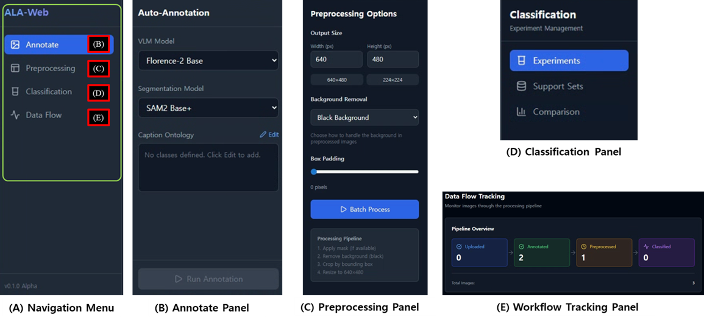

# ALA-AutoLabelAgent

**AI-Powered Image Annotation Platform - Desktop & Web**

Transform your image labeling workflow with AI-powered automation. ALA-AutoLabelAgent combines Florence-2 vision-language models and SAM2 segmentation to deliver fast, accurate annotations through both a desktop application and modern web interface.

[](LICENSE)
[](https://www.python.org/)
[](https://reactjs.org/)
[](https://fastapi.tiangolo.com/)

<p align="center">
  
  <br>
  <em>ALA-Web Dashboard: (A) Navigation (B) Auto-Annotation (C) Preprocessing (D) Classification (E) Data Flow Tracking</em>
</p>

---

## 🎯 Choose Your Interface

### 🖥️ [ALA-GUI](ALA-GUI/) - Desktop Application
**Best for**: Individual users, offline work, direct model control

- **Native PyQt6 desktop app** for Windows, macOS, Linux
- Full-featured image viewer with zoom/pan
- Florence-2 + SAM2 integration
- Offline annotation capabilities
- **Status**: ✅ Production-ready (v0.3.0-alpha)

[**📖 Get Started with Desktop →**](ALA-GUI/README.md)

### 🌐 [ALA-Web](ALA-Web/) - Web Application  
**Best for**: Teams, remote access, modern workflows

- **Modern React + FastAPI** web platform
- Drag-and-drop file uploads
- Caption ontology editor (key-value format)
- Preprocessing pipeline (crop, mask, background removal)
- Real-time collaboration ready
- **Status**: ✅ Core features complete

[**📖 Get Started with Web →**](ALA-Web/README.md)

---

## ✨ Key Features

### 🤖 AI-Powered Automation
- **Florence-2 VLM**: State-of-the-art object detection from text prompts
- **SAM2 Segmentation**: Pixel-perfect mask generation
- **Caption Ontology**: Structured class definitions with descriptions
- **Auto-download**: Models fetch automatically on first use

### 🎨 Complete Annotation Pipeline
1. **Upload** - Drag-and-drop images/videos
2. **Annotate** - AI generates bounding boxes and masks
3. **Preprocess** - Crop, remove backgrounds, resize (640×480)
4. **Review** - Quality control and manual adjustments
5. **Export** - Multiple formats (YOLO, COCO, etc.)

### 🚀 Modern Technology Stack
| Component | Desktop (GUI) | Web |
|:---|:---|:---|
| **Frontend** | PyQt6 | React 18 + TypeScript |
| **Backend** | Python | FastAPI |
| **AI Models** | Florence-2, SAM2 | Florence-2, SAM2 |
| **Image Processing** | OpenCV, Pillow | OpenCV, Pillow |
| **Platform** | Native Desktop | Modern Browser |

---

## 🚀 Quick Start

### Option 1: Desktop Application (ALA-GUI)

```bash
# Clone repository
git clone https://github.com/tygwan/ALA-AutoLabelAgent.git
cd ALA-AutoLabelAgent/ALA-GUI

# Create virtual environment (Python 3.10+)
python -m venv venv
venv\Scripts\activate  # Windows
# source venv/bin/activate  # Linux/macOS

# Install dependencies
pip install -r requirements.txt
pip install timm einops

# Run application
python src/main.py
```

**First Time**: File → Import Images → Tools → Auto-Annotate → Enter classes (e.g., "person, car, dog")

### Option 2: Web Application (ALA-Web)

```bash
# Clone repository
git clone https://github.com/tygwan/ALA-AutoLabelAgent.git
cd ALA-AutoLabelAgent/ALA-Web

# Windows
setup.bat   # Sets up .venv, installs dependencies, downloads models
run.bat     # Launches Backend (8000) and Frontend (5173)

# Linux/macOS
./setup.sh  # Sets up .venv, installs dependencies, downloads models
./run.sh    # Launches Backend (8000) and Frontend (5173)
```

**First Time**: The application will automatically open http://localhost:5173
**More Details**: See [ALA-Web/README.md](ALA-Web/README.md)

---

## 📚 Documentation

### 🌟 Main Guides
- **[ALA-GUI README](ALA-GUI/README.md)** - Desktop app documentation
- **[ALA-Web README](ALA-Web/README.md)** - Web platform documentation

### 🛠️ Setup & Installation
- **[Python Upgrade Guide](ALA-GUI/docs/PYTHON_UPGRADE.md)** - Upgrade to Python 3.10
- **[Model Setup](ALA-GUI/docs/MODEL_SETUP.md)** - AI model configuration
- **[Backend API Docs](http://localhost:8000/docs)** - FastAPI Swagger UI (when running)

### 📖 Technical Deep-Dives
- **[Architecture](ALA-GUI/docs/MAINWINDOW.md)** - Component design
- **[Testing Guide](ALA-GUI/tests/)** - Unit & integration tests
- **[Contributing](ALA-GUI/CONTRIBUTING.md)** - Development workflow

---

## 🗂️ Project Structure

```
ALA-AutoLabelAgent/
├── ALA-GUI/                  # Desktop Application (PyQt6)
│   ├── src/                  # Source code (MVC architecture)
│   │   ├── models/           # AI models (Florence-2, SAM2)
│   │   ├── views/            # PyQt6 UI components
│   │   ├── controllers/      # Business logic
│   │   └── utils/            # Utilities
│   ├── tests/                # 50+ unit, 20+ integration tests
│   ├── docs/                 # Comprehensive documentation
│   └── requirements.txt      # Python dependencies
│
├── ALA-Web/                  # Web Application (React + FastAPI)
│   ├── backend/              # FastAPI server
│   │   ├── routers/          # API endpoints
│   │   ├── services/         # Business logic
│   │   └── main.py           # Entry point
│   ├── frontend/             # React application
│   │   ├── src/
│   │   │   ├── components/   # UI components
│   │   │   ├── pages/        # Page components
│   │   │   └── hooks/        # Custom React hooks
│   │   └── package.json      # Node dependencies
│   └── README.md             # Web app documentation
│
├── model_references/         # Reference implementations
└── README.md                 # This file
```

---

## 🎯 Use Cases

### 🏭 Manufacturing & Quality Control
- Defect detection on assembly lines
- Product classification
- Automated visual inspection

### 🚗 Autonomous Vehicles
- Object detection (pedestrians, vehicles, traffic signs)
- Lane segmentation
- Dataset preparation for training

### 🏥 Medical Imaging
- Cell counting and classification
- Lesion detection
- Medical image annotation

### 🌾 Agriculture
- Crop disease identification
- Yield estimation
- Weed detection

---

## 🔧 System Requirements

### Desktop (ALA-GUI)
- **OS**: Windows 10+, macOS 11+, Ubuntu 20.04+
- **Python**: 3.10+ (recommended), 3.9+ (limited)
- **RAM**: 8GB minimum, 16GB recommended
- **GPU**: CUDA-capable GPU recommended (CPU fallback supported)
- **Storage**: 2GB for models + dataset space

### Web (ALA-Web)
- **Server**: Same as desktop
- **Client**: Modern web browser (Chrome, Firefox, Safari, Edge)
- **Network**: Local or remote deployment supported

---

## 🤝 Contributing

We welcome contributions! Here's how:

1. **Fork** this repository
2. **Create** a feature branch (`git checkout -b feature/amazing-feature`)
3. **Write tests** (we use TDD)
4. **Commit** changes (`git commit -m 'feat: add amazing feature'`)
5. **Push** to branch (`git push origin feature/amazing-feature`)
6. **Open** a Pull Request

See [CONTRIBUTING.md](ALA-GUI/CONTRIBUTING.md) for detailed guidelines.

---

## 📊 Development Status

### ✅ Completed
- **Desktop App (ALA-GUI)**: Production-ready v0.3.0-alpha
  - Interactive image viewer
  - Florence-2 + SAM2 integration
  - Manual model management
  - Comprehensive testing suite

- **Web App (ALA-Web)**: Core features complete
  - Upload & asset management
  - Caption ontology editor
  - Preprocessing pipeline
  - Backend API (13 endpoints)

### 🚧 In Progress
- Manual annotation tools
- Classification workflow
- Data flow tracking

### 📋 Planned
- Few-shot learning integration
- YOLO training pipeline
- Cloud deployment
- Multi-user collaboration

---

## 📝 License

This project is licensed under the MIT License - see the [LICENSE](LICENSE) file for details.

---

## 🙏 Acknowledgments

- **Florence-2**: Microsoft Research (Vision-Language Model)
- **SAM2**: Meta AI (Segment Anything Model 2)
- **PyQt**: Riverbank Computing (GUI Framework)
- **FastAPI**: Sebastián Ramírez (Web Framework)
- **React**: Meta (UI Library)

---

## 📧 Contact & Support

- **Issues**: [GitHub Issues](https://github.com/tygwan/ALA-AutoLabelAgent/issues)
- **Discussions**: [GitHub Discussions](https://github.com/tygwan/ALA-AutoLabelAgent/discussions)
- **Email**: [Create an issue for support]

---

**Last Updated**: 2025-01-19  
**Desktop Version**: v0.3.0-alpha  
**Web Version**: v0.1.0-beta  

---

<p align="center">
  <strong>⭐ Star this project if you find it useful!</strong>
</p>
